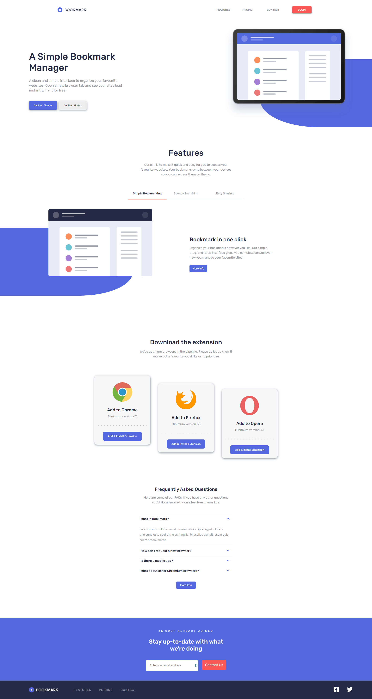

# Frontend Mentor - Bookmark Landing Page Solution

This is a solution to the [Bookmark Landing Page challenge on Frontend Mentor](https://www.frontendmentor.io/challenges/bookmark-landing-page-5d0b588a9edda32581d29158). Frontend Mentor challenges help you improve your coding skills by building realistic projects.

## Table of contents

- [Overview](#overview)
  - [The Challenge](#the-challenge)
  - [Screenshot](#screenshot)
  - [Links](#links)
- [My process](#my-process)
  - [Built with](#built-with)
  - [What I learned](#what-i-learned)

## Overview

### The Challenge

Your users should be able to:
- View the optimal layout for the site depending on their device's screen size
- See hover states for all interactive elements on the page
- Receive an error message when the newsletter form is submitted if:
    - The input field is empty
    - The email address is not formatted correctly

### Screenshot

### Links

- Live Site URL (hosted on Heroku - may load slow): [Bookmark Landing Page](https://bookmarklandingp.netlify.app/)

## My process

I started off matching the design off the refrence, then worked on functionality and then headed into the responsiveness. 

### Built with

- HTML
- CSS
- Flexbox
- [React](https://reactjs.org/) - JS library

### What I learned

I learned how to do overlapping layers and working on responsivness with them.